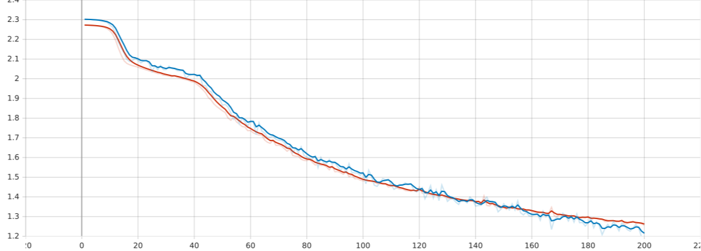

# Visual Transformers

This repository contains an implementation of a visual transformer architecture from scratch using PyTorch  

The repository contains two architectures : a normal ViT (inspired by specifications in the original Visual Transformers paper) as well as a TowerViT model (simple stacking of the transformer blocks, same as with the ViT model but where the dimensions stay static throughout) 

# Installation

```bash
pip install -r requirements.txt
```

Since this is a notebook, I advise you install a jupyter lab server on your own (https://jupyterlab.readthedocs.io/en/stable/getting_started/installation.html)

# Training
As for the easiest way to train the models available in the repo. You can either execute the entire notebook, which should work without any issues. Or you can use the SLURM job script available `train_job.sh` which simply execute the code of the notebook on a cluster with a given number of GPUs (distributed training has not been implemented in the code but would've been nice with `nn.DataParallel` but training seemed slower when testing because of the data synchronization overhead)

There are two notable aspects of the specific training of these models. As specified in the ["AN IMAGE IS WORTH 16X16 WORDS: TRANSFORMERS FOR IMAGE RECOGNITION AT SCALE"](https://arxiv.org/abs/2010.11929) paper : the optimizer (typically Adam for all-purpose training has been changed to SGD for smoother gradient descent) as well as the training momentum ([link](https://paperswithcode.com/method/sgd-with-momentum)) for faster and slightly more stable training.

Additionally, from the paper, I've added positional embedding for tokens (here patches for images) as a trainable parameter of the model as well as a so called 'classification token'. The classification token is a learnable embedding that is prepended to the sequence of patch embeddings (I don't necessarily understand its purpose entirely, but when testing it didn't seem to hinder model performance)

# Results
The training and testing is done in a single function `train_and_validation_loop` with the given number of epochs, device to run on and log writer for Tensorboard display.  
The best models (with lowering evaluation loss) are saved in the `saved_models` dir and Tensorboard logs are stored in the `runs` dir.  

Overall, we see the dynamic embedding dimension ViT model achieves better performance in terms of accuracy (with more trainable parameter). Despite this, the TowerViT model seems to be less prone to overfitting as seen below :

## TowerVit

Model parameters:

  
---

Accuracy :

  
---
  
Training Loss:

  
---
  
Train VS Validation loss:


---
  
Sample inference (best model) :


## Vit

Model parameters:

  
---

Accuracy :

  
---
  
Training Loss:

  
---
  
Train VS Validation loss:


---
  
Sample inference (best model) :


## Comparison

Accuracies :


As for the accuracy of each type of model (with ViT in blue and TowerViT in orange) we can see from the graph above that the model with dynamic embedding dimensions performs better. This is most likely due to the fact that we are able to increase the number of learning parameters (as seen previously above) which means that for the same number of epochs the model converges better.  

From a comparison standpoint, what should have been done here is give the embedding dimension of the TowerVit mode the last embedding dimension of the ViT model. 
  
Regardless, despite the somewhat mediocre performance (barely better than a coin flip, the TowerViT model with less trainable parameters is still able to achieve comparable accuracy to the ViT model.

---

Train. VS Val. :


Another point to be made here is that we notice that despite the ViT model having more trainable parameters than the tower variation, its trainaing to validaiton ratio is very smooth, indicating quality training. As the ViT model starts to perhaps overfit at around 100 epochs 
  
# Notes
Since I haven't tested this notebook much, some variables like local paths may need to be changed to accommodate your needs.
Additionally, what could be done to improve the training in terms of compute would be to properly implement `torch.nn.parallel.DistributedDataParallel` for better parallel computing using NVIDIA's NCCL as the multi-gpu CUDA backend.